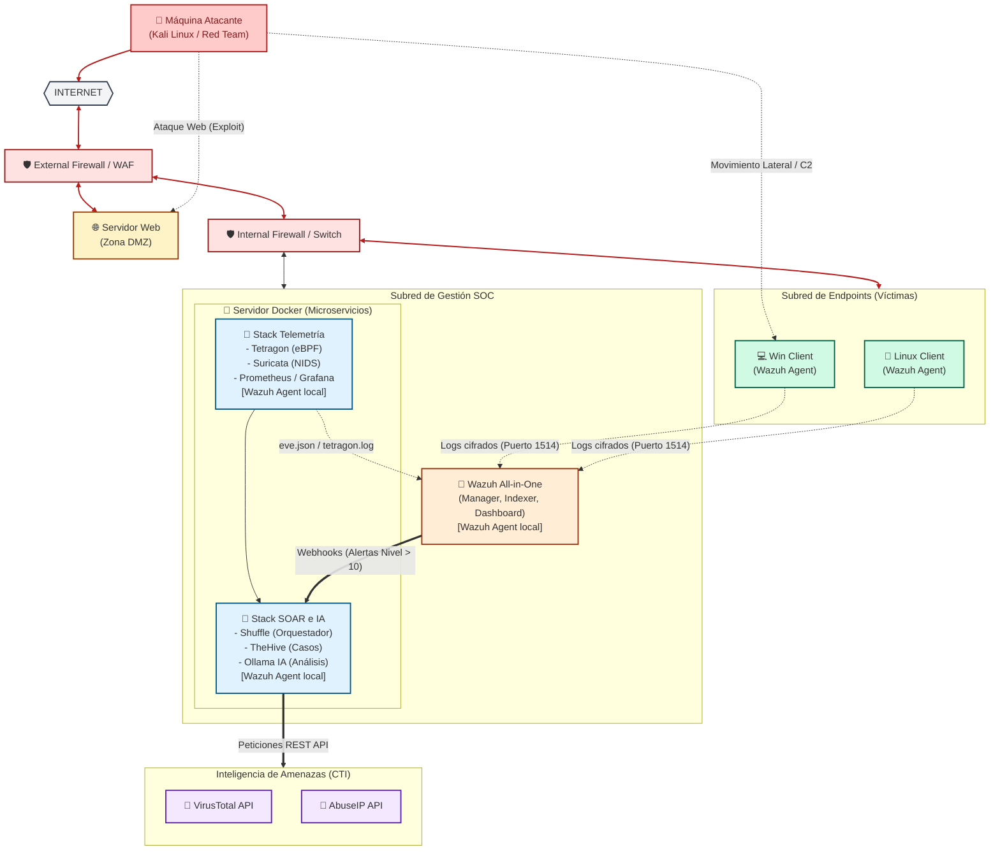

# 🚀 Advanced SOC Lab: eBPF, NIDS, SOAR & Local AI Integration

## 📋 Introducción

Este proyecto representa el diseño e implementación de un **Centro de Operaciones de Seguridad (SOC) de vanguardia**, desplegado en un entorno de laboratorio basado en Proxmox VE. 

El objetivo principal es proporcionar una capacidad integral de monitorización, detección de amenazas, gestión de incidentes y automatización de respuestas (SOAR). Destaca por la integración de tecnologías punteras como **eBPF (Extended Berkeley Packet Filter)** mediante Tetragon para la prevención a nivel de kernel, y el uso de **Inteligencia Artificial (IA) local (Ollama)** para el análisis semántico de alertas de seguridad frente a ataques simulados de Red Team.

---

## 🏗️ Arquitectura Técnica de Red e Infraestructura

El siguiente esquema detalla la topología de red, la segmentación de zonas, la ubicación del atacante y el flujo de telemetría y respuesta de incidentes.

