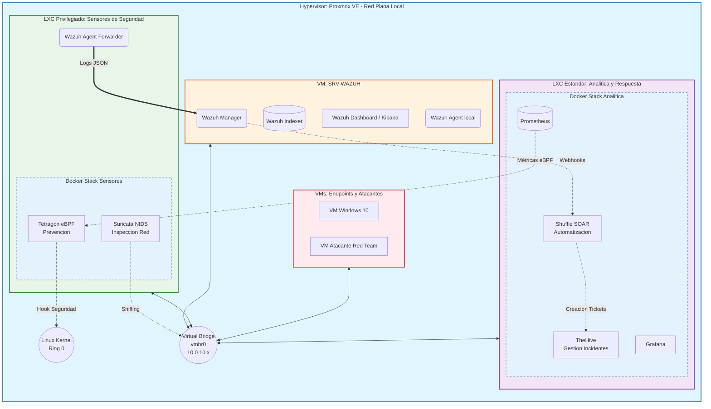

## 🗺️ Arquitectura Técnica

```mermaid
flowchart TB
    %% Estilos corporativos
    classDef proxmox fill:#e1f5fe,stroke:#01579b,stroke-width:2px;
    classDef vm_wazuh fill:#fff3e0,stroke:#e65100,stroke-width:2px;
    classDef lxc_sen fill:#e8f5e9,stroke:#2e7d32,stroke-width:2px;
    classDef lxc_soar fill:#f3e5f5,stroke:#6a1b9a,stroke-width:2px;
    classDef vm_atk fill:#ffebee,stroke:#c62828,stroke-width:2px;
    classDef docker fill:#e3f2fd,stroke:#1565c0,stroke-width:1px,stroke-dasharray: 5 5;

    subgraph PROXMOX [Hypervisor: Proxmox VE - Red Plana Local]
        direction TB
        BRIDGE((Virtual Bridge\nvmbr0\n10.0.10.x))
        KERNEL((Linux Kernel\nRing 0))

        subgraph VM_SIEM [VM: SRV-WAZUH]
            W_MAN(Wazuh Manager)
            W_IDX[(Wazuh Indexer)]
            W_DASH[Wazuh Dashboard / Kibana]
            W_AGT_1(Wazuh Agent local)
        end

        subgraph LXC_SENSORS [LXC Privilegiado: Sensores de Seguridad]
            W_AGT_2(Wazuh Agent Forwarder)
            subgraph DOCKER_1 [Docker Stack Sensores]
                TETRAGON[Tetragon eBPF\nPrevencion]
                SURICATA[Suricata NIDS\nInspeccion Red]
            end
        end

        subgraph LXC_SOAR [LXC Estandar: Analitica y Respuesta]
            subgraph DOCKER_2 [Docker Stack Analitica]
                SHUFFLE[Shuffle SOAR\nAutomatizacion]
                THEHIVE[TheHive\nGestion Incidentes]
                PROM[(Prometheus)]
                GRAF[Grafana]
            end
        end

        subgraph VM_ENDPOINTS [VMs: Endpoints y Atacantes]
            WIN_VICTIMA[VM Windows 10]
            LINUX_ATK[VM Atacante Red Team]
        end

        %% Conexiones Capa 2 (Red local PVE)
        VM_SIEM <--> BRIDGE
        LXC_SENSORS <--> BRIDGE
        LXC_SOAR <--> BRIDGE
        VM_ENDPOINTS <--> BRIDGE
        
        %% Conexiones logicas eBPF y Analisis
        TETRAGON -.->|Hook Seguridad| KERNEL
        SURICATA -.->|Sniffing| BRIDGE
        
        %% Flujo de Alertas y SOAR
        W_AGT_2 == Logs JSON ==> W_MAN
        W_MAN -. Webhooks .-> SHUFFLE
        SHUFFLE -. Creacion Tickets .-> THEHIVE
        PROM -. Métricas eBPF .-> TETRAGON
    end

    class PROXMOX proxmox;
    class VM_SIEM vm_wazuh;
    class LXC_SENSORS lxc_sen;
    class LXC_SOAR lxc_soar;
    class VM_ENDPOINTS vm_atk;
    class DOCKER_1,DOCKER_2 docker;
```
