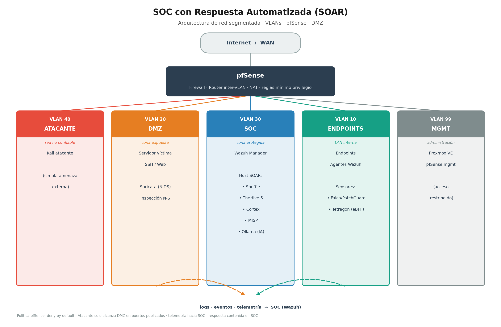

# SOC con Respuesta Automatizada (SOAR)

> **Centro de Operaciones de Seguridad open-source con detección en tres capas y respuesta automatizada**, desplegado sobre Proxmox VE.
> Proyecto de Síntesis — CVL

Plataforma SOC completa que integra detección multicapa (kernel, sistema y red), correlación XDR centralizada y un pipeline SOAR que automatiza el ciclo completo **detección → enriquecimiento → análisis con IA → gestión de caso → notificación** en menos de 60 segundos.



---

## Índice

- [Descripción](#descripción)
- [Arquitectura de red](#arquitectura-de-red)
- [Stack tecnológico](#stack-tecnológico)
- [Capas de detección](#capas-de-detección)
- [Pipeline SOAR](#pipeline-soar)
- [Reglas y detección personalizada](#reglas-y-detección-personalizada)
- [Cadena de ataque (demo)](#cadena-de-ataque-demo)
- [Despliegue](#despliegue)
- [Estructura del repositorio](#estructura-del-repositorio)
- [Endpoints de servicio](#endpoints-de-servicio)
- [Lecciones aprendidas](#lecciones-aprendidas)
- [Trabajo futuro](#trabajo-futuro)
- [Seguridad](#seguridad)
- [Autor](#autor)

---

## Descripción

El proyecto demuestra un SOC funcional construido íntegramente con herramientas open-source sobre un hipervisor **Proxmox VE**. Cubre el ciclo de vida completo de un incidente:

1. **Detectar** actividad maliciosa en tres niveles independientes (kernel vía eBPF, sistema y red).
2. **Correlacionar** las alertas en un SIEM/XDR centralizado.
3. **Responder** de forma automática: enriquecer con inteligencia de amenazas, generar un análisis semántico con IA local, abrir un caso y avisar al analista.

Todo el análisis con IA se ejecuta **localmente** (Ollama), garantizando que ningún dato sensible del SOC salga del laboratorio.

### Objetivos técnicos

- Implementar una arquitectura SOC completa y reproducible sobre Proxmox VE.
- Integrar tres capas de telemetría: kernel (eBPF), sistema (Falco) y red (NIDS).
- Establecer un pipeline de detección → correlación → respuesta automatizada *end-to-end*.
- Usar IA local para análisis semántico sin enviar datos a terceros.
- Demostrar capacidad de bloqueo activo en kernel mediante TracingPolicy de eBPF (SIGKILL).

---

## Arquitectura de red

La red está **segmentada en VLANs** sobre Proxmox VE, con un **firewall pfSense** como router y punto de control entre zonas. El diseño aísla la zona de seguridad (SOC) de los servicios expuestos (DMZ) y del tráfico no confiable del atacante, aplicando una política de mínimo privilegio entre segmentos.

### Segmentos (VLANs)

| VLAN | Zona | Confianza | Direccionamiento | Contenido |
|---|---|---|---|---|
| **40** | Atacante | Ninguna (untrusted) | subred /24 dedicada | Kali atacante; simula amenaza externa |
| **20** | DMZ | Baja (expuesta) | subred /24 dedicada | Víctima SSH/Web, Suricata (NIDS) |
| **30** | SOC | Alta (protegida) | subred /24 dedicada | Wazuh Manager, host SOAR |
| **10** | Endpoints | Media (LAN interna) | subred /24 dedicada | Endpoints + agentes Wazuh + sensores |
| **99** | Management | Crítica (admin) | subred /24 dedicada | Proxmox, pfSense mgmt |

En Proxmox, el bridge `vmbr0` se configura **VLAN-aware**; cada VM se etiqueta con su VLAN tag. pfSense recibe todas las VLANs (router-on-a-stick por subinterfaces, o una NIC por zona) y enruta/filtra entre ellas.

### Placement de componentes

| Componente | Zona (VLAN) | Justificación |
|---|---|---|
| Kali atacante | Atacante (40) | Origen de la amenaza, aislado del resto |
| Víctima SSH/Web | DMZ (20) | Servicio expuesto, primer objetivo del ataque |
| Suricata (NIDS) | DMZ (20) | Inspecciona tráfico norte-sur en el borde expuesto |
| Wazuh Manager | SOC (30) | Correlación central, zona protegida |
| Host SOAR | SOC (30) | Shuffle, TheHive, Cortex, MISP, Ollama |
| Endpoints corporativos | Endpoints (10) | LAN interna con agentes Wazuh y sensores |
| Proxmox + pfSense mgmt | Management (99) | Plano de administración, acceso restringido |

> Los agentes Wazuh y los sensores (Falco/PatchGuard, Tetragon) se despliegan en los hosts a monitorizar de DMZ y Endpoints; reportan al manager en la VLAN SOC.

### Matriz de firewall (pfSense)

Política base: **deny by default**; solo se permite lo explícitamente listado. Filas = origen, columnas = destino.

| Origen ↓ \ Destino → | Atacante | DMZ | SOC | Endpoints | Mgmt | Internet |
|---|---|---|---|---|---|---|
| **Atacante** | — | puertos pub. | ⛔ | ⛔ | ⛔ | NAT* |
| **DMZ** | ⛔ | — | logs→Wazuh | ⛔ | ⛔ | actualizaciones |
| **SOC** | ✅ resp. | ✅ resp. | — | ✅ resp. | ⛔ | feeds MISP |
| **Endpoints** | ⛔ | ⛔ | telemetría→Wazuh | — | ⛔ | NAT |
| **Mgmt** | ✅ | ✅ | ✅ | ✅ | — | ✅ |
| **Internet** | ⛔ | puertos pub. | ⛔ | ⛔ | ⛔ | — |

\* La VLAN atacante con NAT a Internet es opcional; puede dejarse sin salida para un laboratorio totalmente aislado.

**Puertos clave permitidos hacia el SOC:**
- `1514/udp`, `1515/tcp` — agente Wazuh (eventos + registro)
- `514/udp` — syslog (si aplica)
- Acceso a consolas (Wazuh, TheHive, Shuffle, MISP) **solo** desde la VLAN Management o un jump host.

### Flujos de tráfico legítimos

1. **Detección:** sensores en DMZ/Endpoints → eventos → **Wazuh Manager** (SOC).
2. **Correlación:** Wazuh aplica reglas `110xxx` y, al cruzar umbral, dispara el webhook de **Shuffle**.
3. **Respuesta:** Shuffle orquesta dentro del SOC (MISP, Ollama, TheHive); todo el tráfico de respuesta permanece en la VLAN SOC.
4. **Notificación:** Shuffle → Discord (saliente controlado vía pfSense).
5. **Administración:** el analista accede a las consolas únicamente desde Management/jump host.

El tráfico de seguridad **nunca** atraviesa la DMZ ni la red del atacante: la telemetría viaja en sentido Endpoints/DMZ → SOC, y la respuesta queda contenida en el SOC.

### Notas de implementación en Proxmox / pfSense

- **Proxmox:** activar *VLAN aware* en `vmbr0`. Asignar el `VLAN Tag` en la pestaña de red de cada VM.
- **pfSense:** crear las VLANs sobre la interfaz troncal, asignar cada una a una interfaz lógica (OPT1, OPT2…), definir el gateway de cada subred y crear las reglas por interfaz según la matriz.
- **NAT:** outbound NAT para Endpoints (y opcionalmente Atacante) hacia WAN.
- **Anti-spoofing:** mantener el bloqueo de redes privadas/bogon solo en la interfaz WAN, no en las internas.
- **Visibilidad de Suricata:** configurar *port mirroring* / SPAN en el switch virtual si se quiere inspeccionar tráfico entre varios hosts de la misma VLAN.

> **Nota de implementación:** el pipeline *end-to-end* se validó funcionalmente sobre un **único segmento plano** de laboratorio. El diseño segmentado en VLANs aquí descrito es la **arquitectura de referencia**. La migración consiste en (1) hacer `vmbr0` VLAN-aware, (2) etiquetar cada VM con su VLAN, (3) desplegar pfSense con una subinterfaz por VLAN y (4) aplicar la matriz de reglas.

---

## Stack tecnológico

| Tecnología | Función |
|---|---|
| **Proxmox VE** | Hipervisor — virtualización del laboratorio |
| **pfSense** | Firewall / router inter-VLAN / NAT |
| **Wazuh 4.x** | SIEM / XDR / EDR — correlación y gestión de alertas |
| **Tetragon (Cilium)** | eBPF — observabilidad y bloqueo a nivel de kernel |
| **Falco / PatchGuard** | Detección de anomalías a nivel de sistema (syscalls) |
| **Suricata** | IDS / NIDS — análisis de tráfico de red |
| **Shuffle** | SOAR — orquestación de la respuesta automática |
| **TheHive 5** | Gestión de casos e incidentes |
| **Cortex** | Motor de analizadores / enriquecimiento |
| **MISP** | Plataforma de inteligencia de amenazas (IOCs) |
| **Ollama** (`llama3.2:3b`) | IA local — análisis semántico de alertas |
| **Discord** | Canal de notificación al analista |
| **Docker + Portainer** | Containerización y gestión de microservicios |

---

## Capas de detección

| Capa | Sensor | Qué hace |
|---|---|---|
| **Kernel** | Tetragon (eBPF) | Monitorización de kernel con **bloqueo activo**. TracingPolicy `bloqueo-acceso-shadow` mata con **SIGKILL** cualquier proceso que lea `/etc/shadow`. |
| **Sistema** | Falco / PatchGuard | Detección por syscalls (shells, procesos sospechosos, cron). Logs en `/var/log/patchguard/falco.log`. |
| **Red** | Suricata (NIDS) | Análisis de tráfico por firmas (escaneos, exploits, descargas). |

Las tres capas envían sus eventos a **Wazuh**, punto central de correlación.

---

## Pipeline SOAR

Cuando una alerta de Wazuh cruza el umbral configurado, dispara el workflow de Shuffle vía webhook:

```
Wazuh (Webhook)
   │
   ▼
IOC PYTHON ──► MISP            (extracción de observables + enriquecimiento TI)
   │
   ▼
IOC / severidad               (cálculo de severidad y lista de IOCs)
   │
   ▼
OLLAMA (HTTP POST)            (análisis semántico con IA local)
   │
   ▼
CLEAN                         (normalización del resultado)
   │
   ▼
ALERT (TheHive) ──► CASE      (creación de alerta y caso)
   │
   ▼
Discord                       (tarjeta con severidad, activo, IOC y enlace al caso)
```

El resultado final es una **tarjeta en Discord** con el análisis generado por IA: severidad, activo afectado, IOC e hipervínculo directo al caso en TheHive.

> Cortex, AbuseIPDB y VirusTotal se desconectaron del flujo principal para la demo por problemas de conectividad. Teams se descartó: el plan Community gratuito no soporta webhooks → Discord como canal principal.

### Integración Wazuh → Shuffle

La integración se realiza mediante un script personalizado en el manager de Wazuh:

- `/var/ossec/integrations/custom-shuffle.py` — construye el payload y filtra por grupos `falco,tetragon,suricata,ids`.
- `/var/ossec/integrations/custom-shuffle` — lanzador (shell).
- Permisos: `chmod 750`, `chown root:wazuh`, seguido de `systemctl restart wazuh-manager`.

El script mapea los campos de la alerta de Wazuh a las claves `$exec.*` que el workflow espera: `source`, `level`, `description`, `wazuh_id`, `full_log`, `agent.name`, `data`.

Bloque `<integration>` en `ossec.conf`:

```xml
<integration>
  <name>custom-shuffle</name>
  <hook_url>https://<HOST_SOC>:3443/api/v1/hooks/webhook_XXXXXXXX</hook_url>
  <level>7</level>
  <alert_format>json</alert_format>
</integration>
```

> **⚠️ Alineación del umbral:** los eventos reales de Falco llegan a **nivel 7–8**. Si el umbral de la integración está en nivel 12, los ataques **NO** dispararán el workflow aunque se detecten. Alinear el `<level>` con la severidad real antes de cualquier demo. Un umbral demasiado bajo (nivel 1) satura Ollama (CPU-bound) y genera backlog en Shuffle.

---

## Reglas y detección personalizada

- Reglas personalizadas en `soc_rules.xml` / `soc_decoders.xml`, con IDs en la serie **110xxx**.
- Filtrado de la integración por grupos `falco,tetragon,suricata,ids`.
- **Supresión de falso positivo:** Suricata genera alertas de creación de *packet socket* de alto volumen (nivel 8). Se añadió una regla de supresión en Wazuh (`level="0"`) para la regla `110040` cuando `proc.name` es `Suricata-Main`.

---

## Cadena de ataque (demo)

Seis fases desde el atacante (VLAN 40) contra la víctima (VLAN 20 · DMZ), cada una mapeada a MITRE ATT&CK y al sensor que la detecta:

| Fase | Acción | Sensor | MITRE |
|---|---|---|---|
| 1 · Acceso inicial | Fuerza bruta SSH (hydra) | Wazuh | T1110 |
| 2 · Ejecución | Shell interactiva | Falco | T1059.004 |
| 3 · Descubrimiento | `whoami`, `id`, `uname` | Tetragon / Falco | T1033 / T1082 / T1087 |
| 4 · Credenciales ⭐ | `cat /etc/shadow` | Tetragon / Falco | T1003.008 |
| 5 · Transferencia | Descarga de payload | Falco (+ Suricata) | T1105 |
| 6 · Persistencia | Tarea cron maliciosa | Tetragon / Falco | T1053.003 |

La **fase 4** es la acción crítica que cruza el umbral y dispara el SOAR completo. Se incluye un `payload.sh` inofensivo simulado y un script automatizado con pausas (~75 s entre pasos) para no saturar la cola de análisis de Ollama.

---

## Despliegue

Los servicios se despliegan como stacks de Docker Compose gestionados con **Portainer** (stack `soc-analyst`, que prefija los nombres de volumen). El host SOAR ejecuta dos stacks: telemetría (Falco, Tetragon, Suricata) y SOAR (Shuffle, TheHive, Cortex, MISP, Ollama). El manager de Wazuh corre en un host independiente.

### Patrones de infraestructura

**Shuffle / OpenSearch**
- Requiere `vm.max_map_count=262144` en el host y `chown 1000:1000` en el volumen de la BD (evita 502).
- `cluster.initial_master_nodes` es incompatible con `discovery.type=single-node` y debe eliminarse.
- **No** usar Docker Swarm (`SHUFFLE_SWARM_CONFIG`). Usar el hostname interno de Docker para `BASE_URL` (`http://shuffle-backend:5001`), no la IP del host.
- Imágenes `ghcr.io/shuffle/shuffle-*:latest`; las `frikky/shuffle:*` están **obsoletas**. Definir `SHUFFLE_WORKER_IMAGE` y `security_opt: seccomp:unconfined` en Orborus.

**MISP**
- La imagen regenera `php.ini` en cada arranque; las ediciones manuales **no persisten**. Configurar vía variables de entorno.

**Portainer**
- Resuelve los *bind mounts* relativos desde su directorio interno de compose. Usar siempre **rutas absolutas del host**.

**Ollama**
- Usar `llama3.2:3b` con `num_predict: 50–60` y prompts cortos para evitar timeouts en CPU.

**Tetragon**
- Verificar la carga de la TracingPolicy: `tetra tracingpolicy list`. Si aparece vacía: `tetra tracingpolicy add`, o montar la carpeta de políticas como `/etc/tetragon/tetragon.tp.d` en el compose.

### Verificación rápida

```bash
# Comprobar que los stacks están arriba
docker ps

# Probar el webhook de Shuffle (cert autofirmado -> -k)
curl -k https://<HOST_SOC>:3443/api/v1/hooks/webhook_XXXXXXXX

# Revisar la integración en el manager de Wazuh
tail -f /var/ossec/logs/integrations.log

# Estado de las TracingPolicy de Tetragon
tetra tracingpolicy list
```

---

## Estructura del repositorio

```
.
├── README.md
├── LICENSE
├── .gitignore
├── diagrama-arquitectura.png / .svg
├── compose/
│   ├── soar-stack.yml            # Shuffle, TheHive, Cortex, MISP, Ollama
│   ├── telemetry-stack.yml       # Falco, Tetragon, Suricata
│   └── .env.example              # placeholders de credenciales
├── wazuh/
│   ├── soc_rules.xml
│   ├── soc_decoders.xml
│   └── integrations/
│       ├── custom-shuffle.py
│       └── custom-shuffle
├── tetragon/
│   └── policies/
│       └── bloqueo-acceso-shadow.yaml
├── shuffle/            
│   └── workflow-soc.json         # export del workflow SOAR
│   └── Readme.md  
│   └── nodos/
│       └── ioc_python.py
│       └── clean.py             
├── attack/
│   ├── attack-demo.sh
│   └── payload.sh                # simulado / inofensivo
│   └── Readme.md                # simulado / inofensivo
└── docs/
    ├── Memoria_Tecnica.pdf
    └── Memoria_Ejecutiva.pdf
```

---

## Endpoints de servicio

Los servicios del SOAR corren sobre el host de la VLAN SOC; el manager de Wazuh en un host independiente. Sustituye `<HOST_SOC>` y `<WAZUH_MANAGER>` por las direcciones de tu entorno.

| Servicio | URL | Notas |
|---|---|---|
| Shuffle | `https://<HOST_SOC>:3443` | Cert autofirmado (`curl -k`) |
| TheHive | `http://<HOST_SOC>:9000` | |
| MISP | `https://<HOST_SOC>:8443` | Cert autofirmado |
| Cortex | `http://<HOST_SOC>:9001` | |
| Ollama | `http://<HOST_SOC>:11434` | Modelo `llama3.2:3b` |
| Wazuh Manager | `<WAZUH_MANAGER>` | Host independiente (no Docker) |

> Las credenciales y el token del webhook se omiten deliberadamente. Ver [Seguridad](#seguridad).

---

## Lecciones aprendidas

Conocimiento *hard-won* durante la integración del pipeline.

### Shuffle — resolución de variables
- Los nodos Execute Python deben terminar con `print(json.dumps({...}))` para que la notación `$nodo.*` resuelva con fiabilidad aguas abajo (no usar `return`).
- Los nombres de nodo importan exactamente: `IOC PYTHON` exporta como `$ioc_python.*`. Un nombre mal escrito provoca resolución vacía silenciosa, sin error.
- No inyectar objetos JSON completos en el body de Ollama; rompe el payload. Usar texto estático o referencias escalares.
- Leer el webhook como `raw = """$exec"""` y parsear con `json.loads` evita el conflicto con el builtin `exit`.
- Guardar en dos pasos: confirmar el editor del campo **y** guardar el workflow con el icono de disquete del lienzo.

### TheHive
- La ALERT requiere el campo `"source"` (hardcodear `"Wazuh"`).
- `sourceRef` debe ser único por alerta para evitar deduplicación silenciosa. Variar siempre la referencia al testear.
- `.severity` debe ser un entero sin comillas (1–4), no un string.
- Rutas correctas: `$exec.rule.level`, `$exec.rule.description`, `$exec.data.srcip` (no `$exec.level`, `$exec.source`).

### Ollama
- Usar `llama3.2:3b` con `num_predict: 50–60` y prompts cortos para evitar timeouts en CPU, en lugar de subir el timeout del nodo.

---

## Seguridad

Este repositorio es documentación de un **laboratorio académico**. Antes de reutilizar cualquier configuración:

- **No** se publican credenciales, tokens de webhook, claves ni direcciones IP reales. Sustituir todos los placeholders (`<HOST_SOC>`, `<WAZUH_MANAGER>`, `webhook_XXXXXXXX`, `CAMBIAME`) por valores propios.
- Cambiar todas las credenciales por defecto de MISP, TheHive, Cortex y Wazuh.
- El `payload.sh` incluido es **inofensivo y simulado**, solo para demostración.
- Toda la actividad ofensiva se ejecuta exclusivamente dentro del laboratorio aislado, nunca hacia el exterior.

---

## Proyectos relacionados
 
[#proyectos-relacionados](#proyectos-relacionados)
 
- **[Detection-lab](https://github.com/BlueShield-Ch4rl13/Detection-lab)** — catálogo de detecciones en Sigma (detection-as-code), validación automática, conversión a Wazuh/Splunk/Elastic y emulación de adversario con Atomic Red Team sobre esta misma infraestructura, con medición de cobertura MITRE ATT&CK.

---

## Autor

**CVL** — Proyecto de Síntesis

Licencia: [MIT](LICENSE)
```


